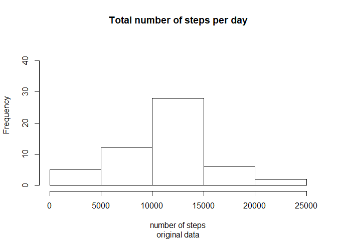
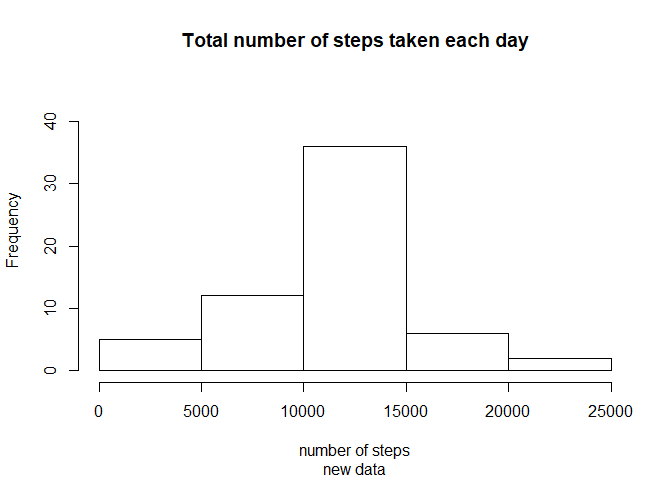
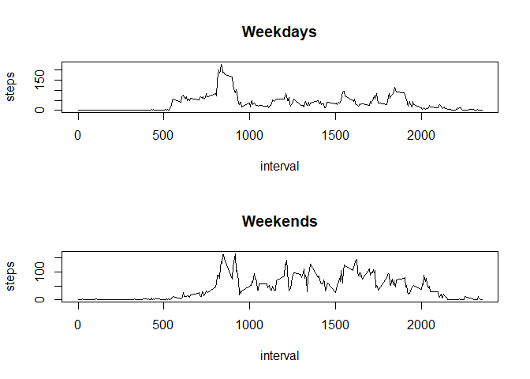

## Read in data

```r
unzip ("activity.zip")
dat <- read.csv("activity.csv")
```

### Plotting histogram of number of steps

```r
hist(aggregate(steps~date, dat, FUN=sum)[,2],
     main="Total number of steps per day",
     xlab="number of steps",ylim=c(0,45),sub="original data")
```

<!-- -->

## Calculate mean and median of number of steps per day

```r
mean(aggregate(steps~date, dat, FUN=sum)[,2])
```

```
## [1] 10766.19
```

```r
median(aggregate(steps~date, dat, FUN=sum)[,2])
```

```
## [1] 10765
```

## Time series plot

```r
## subset data to average across all days
dat2 <- aggregate(steps~ interval,dat,mean)
plot(dat2,type="l")
```

<!-- -->

```r
## 5-min interval (averaged across all days) containing maximum steps
dat2[with(dat2, order(-steps)), ][1,]
```

```
##     interval    steps
## 104      835 206.1698
```

## Impute missing values

```r
## Calculate the missing values in the data
sum(is.na(dat))
```

```
## [1] 2304
```

```r
##imputing missing values with average number of steps for that 5-min interval across all days
dat_new <- dat

dat_new$steps <- ifelse(is.na(dat_new$steps), dat2$steps, dat_new$steps)
```

## Use the new dataframe to create plots and compare with original results


```r
hist(aggregate(steps~date, dat_new, FUN=sum)[,2],
     main="Total number of steps taken each day",
     xlab="number of steps",ylim=c(0,45),sub="new data")
```

<!-- -->

```r
mean(aggregate(steps~date, dat_new, FUN=sum)[,2])
```

```
## [1] 10766.19
```

```r
median(aggregate(steps~date, dat_new, FUN=sum)[,2])
```

```
## [1] 10766.19
```


## Weekdays and Weekends

```r
dat_new$date <-as.POSIXct(dat_new$date,tz="",format="%Y-%m-%d")

dat_new$day <- weekdays(dat_new$date)
dat_new$day <- ifelse(dat_new$day %in% c("Saturday", "Sunday"),"weekend","weekday")

par(mfrow=c(2,1))
plot(aggregate(steps~interval,dat_new[dat_new$day=="weekday",],mean),type="l",main="Weekdays")
plot(aggregate(steps~interval,dat_new[dat_new$day=="weekend",],mean),type="l",main="Weekends")
```

<!-- -->
